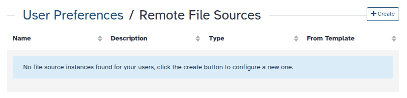
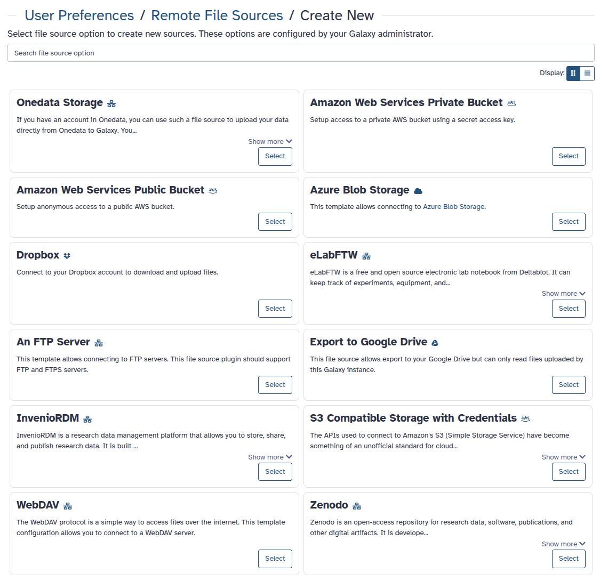

Any InvenioRDM-compatible repository can be connected to Galaxy, offering a streamlined experience in managing and analyzing your research data. With this integration, you can export research results directly from Galaxy to your institution's InvenioRDM repository or Zenodo, and import files from these repositories into Galaxy for reproducible analysis workflows.

# InvenioRDM

[InvenioRDM](https://inveniosoftware.org/products/rdm/) is a research data management platform designed to help organizations effectively manage, publish, and showcase their research data. It provides an infrastructure for storing, sharing, and preserving research outputs, making it a valuable tool for researchers and institutions.

# Zenodo

[Zenodo](https://zenodo.org/) is an open repository for all scholarship, enabling researchers from all disciplines to share and preserve their research outputs, regardless of size or format. Free to upload and free to access, Zenodo makes scientific outputs of all kinds citable, shareable and discoverable for the long term.

It's worth noting that [Zenodo, in October 2023, migrated to InvenioRDM as its underlying technical platform](https://blog.zenodo.org/2023/10/13/2023-10-13-zenodo-rdm/). This move not only makes this integration fully compatible with Zenodo but also signals a commitment to enhanced features and scalability, further bolstering the integration's potential benefits for researchers.

# Getting started

For testing purposes, you can use the [Zenodo sandbox instance](https://sandbox.zenodo.org/) to explore the functionality of the plugin.

## Setting up your PAT (Personal Access Token)

To be able to upload files and browse protected records, you need to create an account and set up your PAT (Personal Access Token). In this case, in the Zenodo sandbox instance. To create a new token:

1. Go to your `user settings` and select the `Applications` tab.
2. Then, click on `New token` and give it a name and the necessary permissions.

## How to integrate InvenioRDM repositories in Galaxy 25.0

The new `Manage Your Remote File Sources` section is available under `User → Preferences`. We will integrate the Zenodo Sandbox instance for demonstration purposes, but you can also configure your institution's InvenioRDM instance. Here’s how it works:

1. Navigate to `User → Preferences → Manage Your Remote File Sources`. If you haven't set up any integrations yet, you'll see an empty list.
   
2. Click `+ Create` to configure a new integration. You'll see a list of available integrations, including `S3, Dropbox, InvenioRDM, Zenodo`, and more (depending on your Galaxy server).
   
3. Select `InvenioRDM` to configure it and enter your **credentials or relevant connection details**.
   
4. Once set up, your InvenioRDM integration, in this case, `My Zenodo Sandbox`, will appear in the list where you can manage or delete it.
   
5. Similar to what we described in the [previous post in the sections about importing and exporting](../2024-05-03-inveniordm-integration/#importing-records-and-files-into-galaxy) your selected integrations will appear first when browsing import/export locations. Note that for some time, the old integrations will still be available, but we recommend using the new interface for a better experience as we will eventually phase out the old integrations.
   

**Note:** If you want to integrate the "real" Zenodo instance, we recommend using the Zenodo integration instead of InvenioRDM. This will improve the integration further by making it more prominent in some parts of the Galaxy interface.

## Importing records and files into Galaxy

From the Upload tool, you can select `Choose remote files` and then search for the Zenodo sandbox instance. Remember that this will only appear if the InvenioRDM plugin is configured to connect to the Zenodo sandbox in your Galaxy instance.

Once you have selected the Zenodo sandbox instance, you can browse public records and import them into your Galaxy history. You can choose to import the full record or individual files in the same way you would import files from any other remote source.

## Exporting your Galaxy history

From the history menu, you can select `Export History to File` and then choose `to RDM repository`. You will be prompted to select the InvenioRDM repository you want to export your history to. Once you have selected the repository, you can decide whether to create a new record or upload the history to an existing draft record.

You can always edit the record metadata directly from the Zenodo sandbox web interface. Once you are satisfied with the record, you can publish it, generating a DOI that others can use to cite your research. Of course, in the case of the sandbox instance, the DOI is not minted and your data is not stored permanently. But the experience is the same as with the production instance.

# New Improvements in the Galaxy 25.0 Release

Compared to the integration in earlier Galaxy releases, several improvements have been made in the Galaxy 25.0 release. Managing external data sources is now more user-friendly and customizable, ensuring a smoother experience when importing and exporting research data.

Some of the limitations of the previous integration, such as the limited number of records that could be listed, the lack of support for pagination, and the inability to use the Export datasets tool with InvenioRDM repositories have also been addressed.

## Advantages

- **Decluttered Interface**: A more focused list of integration, instead of an overwhelming list of all possible sources that may or may not be relevant to you. Galaxy instances will still provide publicly available integrations globally, but those requiring credentials will be managed by you. The old integrations will still be available for some time but will gradually be phased out and removed from the interface.
- **Customization**: You can tailor your integrations to your needs, giving your own names and descriptions to easily identify.
- **Faster Access**: Your configured integrations are prioritized when importing/exporting, making them easier to find.
- **Easier Management**: You can update or remove integrations anytime from `User Preferences`, reducing the need to search for the right place to enter credentials.

# References

This FAQ is based on the following Galaxy News articles by David López:

1. [InvenioRDM and Zenodo integration in Galaxy](https://galaxyproject.org/news/2024-05-03-inveniordm-integration/)
2. [Updates to your InvenioRDM and Zenodo integration in Galaxy
   ](https://galaxyproject.org/news/2025-03-10-inveniordm-integration-update/)
