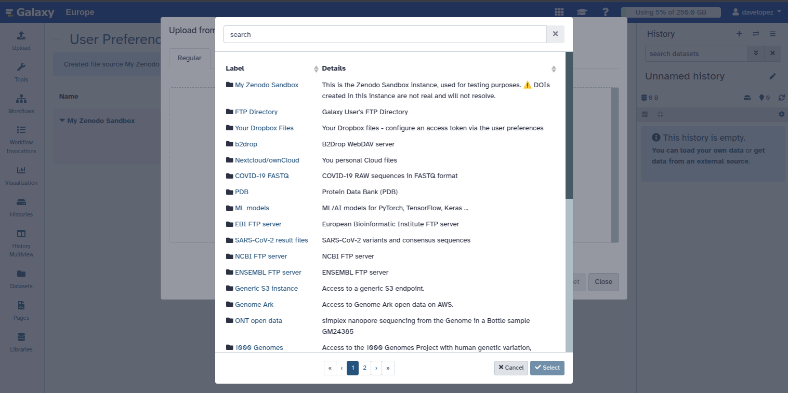
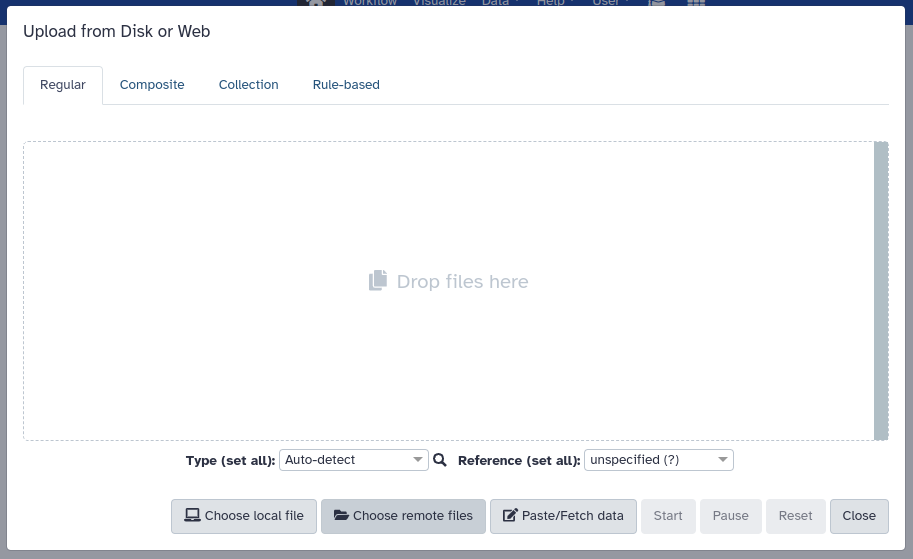

# Overview

Discover a more streamlined approach to research data management with Galaxy's integration with InvenioRDM-compatible repositories.

<agenda-title></agenda-title>
> In this tutorial we will deal with:
>
> 1. TOC
> {:toc}
>
{: .agenda}

# Introduction

Any InvenioRDM-compatible repository can be connected to Galaxy, offering a streamlined experience in managing and analyzing your research data. With this integration, you can export research results directly from Galaxy to your institution's InvenioRDM repository or Zenodo, and import files from these repositories into Galaxy for reproducible analysis workflows.

## InvenioRDM

[InvenioRDM](https://inveniosoftware.org/products/rdm/) is a research data management platform designed to help organizations effectively manage, publish, and showcase their research data. It provides an infrastructure for storing, sharing, and preserving research outputs, making it a valuable tool for researchers and institutions.

## Zenodo

[Zenodo](https://zenodo.org/) is an open repository for all scholarship, enabling researchers from all disciplines to share and preserve their research outputs, regardless of size or format. Free to upload and free to access, Zenodo makes scientific outputs of all kinds citable, shareable and discoverable for the long term.

It's worth noting that [Zenodo, in October 2023, migrated to InvenioRDM as its underlying technical platform](https://blog.zenodo.org/2023/10/13/2023-10-13-zenodo-rdm/). This move not only makes this integration fully compatible with Zenodo but also signals a commitment to enhanced features and scalability, further bolstering the integration's potential benefits for researchers.

# Getting started

For testing purposes, you can use the [Zenodo sandbox instance](https://sandbox.zenodo.org/) to explore the functionality of the plugin.

## Setting up your PAT (Personal Access Token)

To be able to upload files and browse protected records, you need to create an account and set up your PAT (Personal Access Token). In this case, in the Zenodo sandbox instance. To create a new token:

> <hands-on-title>Create Your Personal Access Token</hands-on-title>
> 
> 1. Go to your `user settings` and select the `Applications` tab.
>
> 2. Then, click on `New token` and give it a name and the necessary permissions.
>
>    
{: .hands_on}

## How to integrate InvenioRDM repositories in Galaxy 25.0

The new `Manage Your Remote File Sources` section is available under `User → Preferences`. We will integrate the Zenodo Sandbox instance for demonstration purposes, but you can also configure your institution's InvenioRDM instance. Here’s how it works:

> <hands-on-title>Integration in Galaxy</hands-on-title>
> 
> 1. Navigate to `User → Preferences → Manage Your Remote File Sources`. If you haven't set up any integrations yet, you'll see an empty list.
> 
>
> 2. Click `+ Create` to configure a new integration. You'll see a list of available integrations, including `S3, Dropbox, InvenioRDM, Zenodo`, and more (depending on your Galaxy server).
> 
> 
> 3. Select `InvenioRDM` to configure it and enter your **credentials or relevant connection details**.
> 
> 
> 4. Once set up, your InvenioRDM integration, in this case, `My Zenodo Sandbox`, will appear in the list where you can manage or delete it.
> 
> 
> 5. Your selected integrations will appear first when browsing import/export locations. 
> 
{: .hands_on}

> <comment-title></comment-title>
> If you want to integrate the "real" Zenodo instance, we recommend using the Zenodo integration instead of InvenioRDM. This will improve the integration further by making it more prominent in some parts of the Galaxy interface.
>
{: .comment}

> <details-title>Do you want to add a different repository to Galaxy?</details-title>
>   There are a number of additional repository types that you can connect to Galaxy and use to importing and exporting data.
>
>    
>
{: .details}

# Importing records and files into Galaxy

Once you have integrated an InvenioRDM respository into Galaxy, you will be able to import records and files stored in the remote repository into Galaxy.

> <hands-on-title>Importing Files</hands-on-title>
> 
> 1. From the Upload tool, you can select `Choose remote files`
> 
>
> 2. Search for the Zenodo sandbox instance. Remember that this will only appear if the InvenioRDM plugin is configured to connect to the Zenodo sandbox in your Galaxy instance.
> 
{: .hands_on}

Once you have selected the Zenodo sandbox instance, you can browse public records and import them into your Galaxy history. You can choose to import the full record or individual files in the same way you would import files from any other remote source.

# Exporting your Galaxy history

You can export your history directly to Zenodo. A benefit of publishing your history on Zenodo is that Zenodo will generate a DOI for your history. You can then include this DOI in your publication and it can be used by other researchers to cite your work.

> <hands-on-title>Exporting a History</hands-on-title>
> 
> 1. From the history menu, you can select `Export History to File`
>
> 2. Then choose `to RDM repository`. 
> 
> 3. You will be prompted to select the InvenioRDM repository you want to export your history to. 
> 
> 4. Once you have selected the repository, you can decide whether to create a new record or upload the history to an existing draft record.
> 
{: .hands_on}

You can always edit the record metadata directly from the Zenodo sandbox web interface. Once you are satisfied with the record, you can publish it, generating a DOI that others can use to cite your research. Of course, in the case of the sandbox instance, the DOI is not minted and your data is not stored permanently. But the experience is the same as with the production instance.

# Conclusion

In this tutorial, we have covered how to connect an InvenioRDM-compatible respository, such as a Zenodo repository, to a Galaxy instance. We have also shown how to import files and records from Zenodo into Galaxy and how to export a Galaxy History to Zenodo.

# References

1. [InvenioRDM and Zenodo integration in Galaxy](https://galaxyproject.org/news/2024-05-03-inveniordm-integration/)
2. [Updates to your InvenioRDM and Zenodo integration in Galaxy
   ](https://galaxyproject.org/news/2025-03-10-inveniordm-integration-update/)
